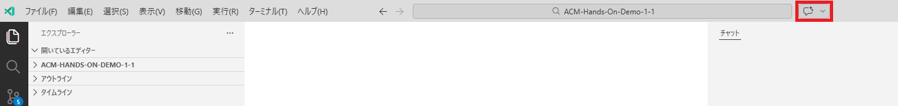

# 演習 2: GitHub Copilot Chatによるテストコード生成

| [← 前の手順: ウェブサイトの探索と機能理解][previous-lesson] | |
|:--|--:|

GitHub Copilot Chatを活用して、Smart Bookmarksの機能に対応したPlaywright E2Eテストコードを生成します。

## シナリオ

Smart Bookmarksウェブサイトの機能を理解した今、AIアシスタントを使って効率的にテストコードを作成します。GitHub Copilot Chatに適切な指示を出すことで、プロジェクトのコーディング規約に準拠した高品質なPlaywrightテストを生成します。

この演習では、AIアシスタントとの効果的なコミュニケーション方法を学び、手動では時間のかかるテストコード作成を大幅に加速します。

## ? 必須 1. GitHub Copilot Chatの起動

VS Code環境でGitHub Copilot Chatを有効化し、テストコード生成に備えます。

**Chatセッションの初期化**: 新しいChatセッションを開始してください。既存の会話がある場合は、「New Chat」ボタンで新しいセッションを作成します。

1. **Copilot Chatビューの開き方**:
   - VS Codeの右サイドバーにあるチャットアイコン（?）をクリック
   - または、アクティビティバーの「Chat」をクリック
   - Copilot Chatビューが右側に表示されることを確認



## ? 必須 2. プロンプト設計による効果的なテストコード生成

プロジェクトの品質基準に従った詳細なプロンプトを作成します。

> ? **ワンポイント**: E2E（End-to-End）テストとは、実際のユーザーの操作を模して、ブラウザでWebアプリケーション全体の動作を自動検証するテストです。

1. **ファイル作成とコード生成のプロンプト**:
   Copilot Chatに以下のプロンプトを入力してください：

   ```
   https://ravi-cheetiralaav.github.io/smart-bookmarks のカテゴリによる表示内容切り替え機能について、Playwright（TypeScript）の E2E テストコードを生成し、tests/category-filter.spec.ts ファイルを作成してください。

   - ロケーターはユーザー向けの role ベース（getByRole / getByLabel / getByText など）を優先してください
   - 操作は test.step() で目的ごとにグルーピングしてください
   - アサーションは auto-retrying な web-first assertion（例: await expect(locator).toHaveText()）を使ってください
   - ハードコード待機（waitForTimeout など）は避けてください
   ```

2. **マニフェストファイルの記述要求への対処**:
   テストコード生成時に、VS CodeがPlaywrightの記述をプロジェクトのマニフェストファイル（package.json等）に追加することを求める場合があります。

   - **確認ダイアログが表示された場合**:
     - 「Allow」ボタンを押下して、Playwrightの依存関係追加を許可してください
     - これにより、プロジェクトに必要なPlaywright設定が自動的に追加されます
   
   - **マニフェストファイル更新の内容**:
     - `@playwright/test` 依存関係の追加
     - テスト実行用スクリプトの追加
     - Playwright設定ファイルの参照設定

3. **ファイル作成の確認**:
   - Copilotが `tests` フォルダーと `category-filter.spec.ts` ファイルを作成したことを確認
   - VS Codeのエクスプローラーでファイル構造を確認
   - ファイルが作成されていない場合は、手動で作成してコードをコピー

## ? 必須 3. 生成されたテストコードの確認

Copilot Chatが生成したコードとファイルの品質を確認します。

1. **ファイル構造の確認**:
   - `tests/category-filter.spec.ts` ファイルが作成されているか
   - TypeScriptの構文エラーがないか
   - ファイルが正常に保存されているか
2. **コード品質の確認**:
   - 適切なimport文（`import { test, expect } from '@playwright/test';`）
   - `test.describe` ブロックでのテストグループ化
   - `test.step()` による手順の明確化
   - roleベースロケーター（`getByRole`, `getByText`など）の使用
   - web-first assertionの使用

3. **期待されるコード構造例**:
   ```typescript
   import { test, expect } from '@playwright/test';

   test.describe('Category Filter - Switch displayed bookmarks by category', () => {
     test.beforeEach(async ({ page }) => {
       await page.goto('https://ravi-cheetiralaav.github.io/smart-bookmarks');
     });

     test('Category Filter - switching category updates the bookmark list', async ({ page }) => {
       await test.step('Confirm initial category and list', async () => {
         // 初期状態の確認
       });

       await test.step('Switch category and verify filtered result', async () => {
         // カテゴリ切り替えと結果確認
       });
     });
   });
   ```

**ファイル作成がうまくいかない場合**:
- 手動で `tests` フォルダーを作成
- `tests/category-filter.spec.ts` ファイルを新規作成
- 生成されたコードをコピー&ペースト
- `Ctrl+S` でファイルを保存


## まとめ

? **おめでとうございます！** ?

GitHub Copilot Chatを活用したE2Eテストコードの生成が完了しました。AIアシスタントとの協働によって、今まで数時間かかっていたテストコード作成を数分で完了することができました。

### ? 習得したスキル
- **AIプロンプトエンジニアリング**: 効果的な指示で高品質なコードを生成
- **Playwrightベストプラクティス**: モダンなE2Eテストの実装方法
- **コード品質管理**: プロジェクト規約に準拠したコード作成
- **効率的開発**: AIと人間の協働による生産性向上

### ? 今後の展開
この経験をベースに、以下のような発展を検討してください：
- 他のUI機能（検索、ソート、フィルタリング）のテスト作成
- パフォーマンステストやアクセシビリティテストの導入
- CI/CDパイプラインへの自動テスト組み込み
- AIアシスタントを活用した他の開発タスクの効率化

**?? よくある問題と解決方法**:

| 問題 | 解決方法 |
|------|----------|
| Copilot Chatが応答しない | インターネット接続を確認、VS CodeでGitHubに再ログイン |
| 生成されたコードが不適切 | より具体的なプロンプトで再生成を依頼 |
| TypeScript構文エラー | `npm install @playwright/test` でPlaywrightを再インストール |

## リソース

- [Playwright公式ドキュメント](https://playwright.dev/)
- [GitHub Copilotベストプラクティス](https://docs.github.com/copilot)

---

| [← 前の手順: ウェブサイトの探索と機能理解][previous-lesson] | |
|:--|--:|

[previous-lesson]: ./1-explore-website.md
   - playwright.config.ts の設定を確認
   - tsconfig.json のTypeScript設定を確認

## まとめと次のステップ

GitHub Copilot Chatを活用したE2Eテストコード生成が完了しました：

- **効率的なプロンプト設計**: プロジェクト要件を明確に伝える技術
- **品質の高いテストコード**: プロジェクト規約に準拠した実装
- **AI支援開発プロセス**: 手動作業の大幅な削減と品質向上

### 習得したスキル

- **AIアシスタントの効果的な活用**: 適切な指示によるコード生成
- **ウェブテスト理解**: ブラウザ自動化テストの基本パターン
- **カスタム指示の活用**: プロジェクト固有のルールに従った開発
- **テストコードレビュー**: 生成されたコードの品質評価能力

### 今後の展開

生成されたテストコードをベースに、以下の拡張を検討してください：

- 他の機能（タグ絞り込み、検索機能等）のテストケース追加
- パフォーマンステストやアクセシビリティテストの実装
- 自動テストの継続的実行環境への組み込み

## リソース

- [GitHub Copilot 公式ドキュメント](https://docs.github.com/copilot)
- [Playwright 公式ドキュメント](https://playwright.dev/)
- [TypeScript 公式ドキュメント](https://www.typescriptlang.org/docs/)

---

| [← 前の手順][previous-lesson] | |
|:--|--:|

[previous-lesson]: ./1-explore-website.md