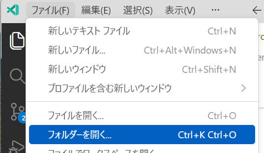
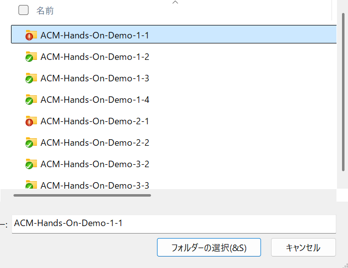

# 演習 2: 開発環境のセットアップ

| [← 前の手順][previous-lesson] | [次の手順: GitHub Copilot Chatによるテストコード生成 →][next-lesson] |
|:--|--:|

E2Eテスト開発に必要なプロジェクト環境を構築し、適切なブランチでの作業準備を整えます。

## シナリオ

開発チームでは、機能開発用のブランチ「JP-translation」をベースとして、新しいテスト実装用のブランチを作成する運用ルールがあります。あなたは、このルールに従って適切な開発環境を構築し、チームの品質基準に従ったテストコードを実装する準備を行います。

GitとPowerShellを使用した効率的なワークフローを習得し、継続的インテグレーション環境に適合した開発プロセスを実践します。

## ? 必須 1. PowerShellによるリポジトリクローン

PowerShellを使用してプロジェクトリポジトリをローカル環境に取得します。

1. **PowerShellの起動**:
   - スタートメニューから「PowerShell」を検索
   - 「Windows PowerShell」を右クリック → 「管理者として実行」を選択
   - UACプロンプトが表示された場合は「はい」をクリック

2. **作業ディレクトリの準備(必要ならば)**:
   ```powershell
   # 作業用ディレクトリに移動（例：C:\workフォルダー）
   cd C:\work
   # フォルダーが存在しない場合は作成
   New-Item -ItemType Directory -Force -Path C:\work
   ```

3. **リポジトリのクローン**:
   ```powershell
   # GitHubリポジトリをクローン
   git clone https://github.com/Avanade-Sdlc-Foundation/ACM-Hands-On-Demo-1-1.git
   ```

4. **クローン結果の確認**:
   ```powershell
   # クローンしたディレクトリに移動
   cd ACM-Hands-On-Demo-1-1
   # ディレクトリ内容を確認
   Get-ChildItem
   ```

## ? 必須 2. ブランチ管理とチェックアウト

JP-translationブランチをベースとした新しい作業ブランチを作成します。

1. **リモートブランチの確認**:
   ```powershell
   # 全ブランチ（リモート含む）を表示
   git branch -a
   ```

2. **JP-translationブランチへの切り替え**:
   ```powershell
   # JP-translationブランチにチェックアウト
   git checkout JP-translation
   ```

3. **ブランチの最新化**:
   ```powershell
   # リモートから最新の変更を取得
   git pull origin JP-translation
   ```

4. **新しい作業ブランチの作成**:
   ```powershell
   # JP-translationから新しいブランチを作成・チェックアウト
   git checkout -b feature/e2e-test-creation
   ```

5. **ブランチ作成の確認**:
   ```powershell
   # 現在のブランチ状態を確認
   git branch
   # 現在のブランチが feature/e2e-test-creation になっていることを確認
   ```

## ? 必須 3. プロジェクト初期化

Playwrightテスト環境のための初期セットアップを行います。

1. **package.jsonの初期化**:
   ```powershell
   # Node.jsプロジェクトとして初期化
   npm init -y
   ```

2. **Playwrightの依存関係追加**:
   ```powershell
   # Playwrightテストフレームワークをインストール
   npm install --save-dev @playwright/test
   ```

3. **インストール確認**:
   ```powershell
   # package.jsonでPlaywrightの追加を確認
   Get-Content package.json
   ```

## ? 必須 4. VS Codeでプロジェクトを開く

開発環境としてVS Codeでプロジェクトを立ち上げます。

1. **VS Codeの起動**:
   - スタートメニューから「Visual Studio Code」を起動

2. **フォルダーを開く操作**:
   - VS Codeのメニューから「File」→「Open Folder」を選択
   - ファイルダイアログが開きます
   

3. **プロジェクトフォルダーの選択**:
   - ナビゲーターでクローンしたプロジェクトフォルダーを見つける
   - 「ACM-Hands-On-Demo-1-1」フォルダーを選択
   - 「フォルダーの選択」ボタンをクリック
   

## ? 参考 5. VS Code拡張機能の確認

効率的な開発のために必要な拡張機能を確認します。

1. **GitHub Copilot拡張の確認**:
   - 拡張機能パネル（Ctrl+Shift+X）を開く
   - 「GitHub Copilot」で検索
   - インストール済み・有効化されていることを確認

2. **Playwright関連拡張の確認**:
   - 「Playwright Test for VSCode」拡張機能を検索
   - インストールされていない場合は、インストールを検討

3. **TypeScript関連拡張の確認**:
   - VS Codeの内蔵TypeScriptサポートが有効であることを確認


## ? トラブルシューティング

### Git関連のエラー

1. **認証エラーが発生する場合**:
   ```powershell
   # Git認証情報の確認
   git config --list --show-origin
   # 必要に応じてユーザー情報を設定
   git config --global user.name "Your Name"
   git config --global user.email "your.email@example.com"
   ```

2. **ブランチが見つからない場合**:
   ```powershell
   # リモートの最新情報を取得
   git fetch origin
   # 再度ブランチを確認
   git branch -a
   ```

### PowerShell実行ポリシーエラー

1. **実行ポリシーの確認と設定**:
   ```powershell
   # 現在の実行ポリシーを確認
   Get-ExecutionPolicy
   # 必要に応じて変更（管理者権限が必要）
   Set-ExecutionPolicy -ExecutionPolicy RemoteSigned -Scope CurrentUser
   ```

### VS Codeでプロジェクトが正しく開かない場合

1. **ワークスペースの設定**:
   - 「File」→「Add Folder to Workspace」で追加
   - 「File」→「Save Workspace As」でワークスペースを保存

2. **拡張機能の問題**:
   - 「Help」→「Reload Window」でVS Codeを再読み込み
   - 必要な拡張機能をインストール・有効化

## まとめと次のステップ

開発環境のセットアップが完了しました：

- **リポジトリクローン**: GitHub上のプロジェクトをローカル環境に取得
- **ブランチ管理**: JP-translationベースの新しい作業ブランチを作成
- **プロジェクト初期化**: Node.jsプロジェクトとPlaywright環境のセットアップ
- **VS Code環境**: 効率的な開発のためのIDE設定完了

次のステップでは、GitHub Copilot Chatを活用して実際のE2Eテストコードを生成し、プロジェクトの品質基準に従ったテスト実装を行います。

## リソース

- [PowerShell公式ドキュメント](https://docs.microsoft.com/powershell/)
- [Git公式ドキュメント](https://git-scm.com/doc)
- [VS Code公式ドキュメント](https://code.visualstudio.com/docs)

---

| [← 前の手順][previous-lesson] | [次の手順: GitHub Copilot Chatによるテストコード生成 →][next-lesson] |
|:--|--:|

[previous-lesson]: ./1-explore-website.md
[next-lesson]: ./3-generate-tests.md