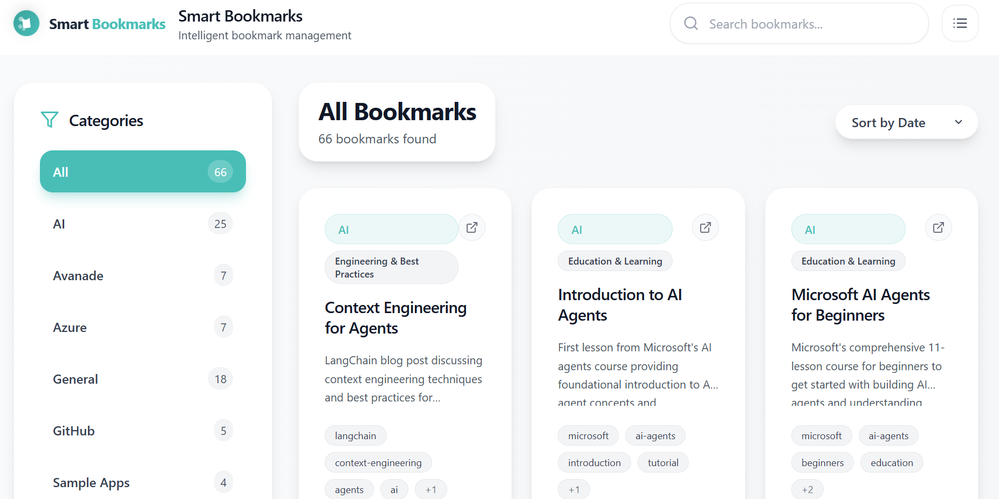

# Hands-on:ウェブアプリケーションのE2Eテストケース作成

## 目的
ウェブサイト [Smart Bookmarks](https://ravi-cheetiralaav.github.io/smart-bookmarks) を探索し、その機能とユーザーインターフェイスに慣れ、ブラウザ E2E テストケースを生成してください。

## 概要
1. **ウェブサイトの探索**: 上記の URL にアクセスし、Smart Bookmarks ウェブサイトを探索してください。利用可能な機能、ユーザーインターフェイスの要素、およびユーザーがどのように操作するかを理解してください。
2. **テストケースの生成**: 各機能に対して、CopilotChat にテストケースを生成させる。

## 手順書

### **1.ウェブサイトの探索** 
  1-1.ウェブサイト [Smart Bookmarks](https://ravi-cheetiralaav.github.io/smart-bookmarks)をクリックし、ブラウザの機能を確認してください。

　
>Smart Bookmarksの主要機能
  - カテゴリ機能: All(66件), AI(25件), Avanade(7件), Azure(7件), General(18件), GitHub(5件), Sample Apps(4件)のカテゴリでブックマークを分類・フィルタリング
  - タグシステム: 豊富なタグ（ai、azure、github、authentication、deployment、architecture等）による詳細な分類とフィルタリング
  - 検索・フィルタリング機能: カテゴリまたはタグをクリックすることで、該当するブックマークのみを表示
  - ブックマーク詳細表示: 各ブックマークにタイトル、説明、URL、追加日時、関連タグを表示
  - カウント表示機能: 各カテゴリとタグに該当するブックマーク件数を表示
  - レスポンシブデザイン: モバイルデバイスにも対応したUI

### **2.テストケースの生成**
  2-1. **リポジトリのクローン**  
    - GitHubまたは提供されたリポジトリURLからローカル環境にクローンします  
    　→リポジトリURL：https://github.com/example/smart-bookmarks-tests  
    - `git clone <repository-url>` コマンドを実行するか、GitHub Desktopを使用してクローンします  

  2-2. **VS Codeでプロジェクトを開く**  
    - VS Codeを起動します  
    - File > Open Folder からクローンしたプロジェクトフォルダーを選択して開きます  
    - または、コマンドラインから `code .` でプロジェクトを開きます  

  2-3. **GitHub Copilot Chatの起動**  
    - VS Codeの右サイドバーにあるチャットアイコンをクリックしてCopilot Chatビューを開きます  
    
    - またはキーボードショートカット `Ctrl+Alt+I`（Windows/Linux）または `Cmd+Option+I`（Mac）を使用します  
    

  2-4. **プロンプト入力によるテストコード生成**  
    >プロンプト例:  
```
https://ravi-cheetiralaav.github.io/smart-bookmarks のカテゴリによる表示内容切り替え機能について、Playwright（TypeScript）の E2E テストコードを生成してください。
- テストは `tests/category-filter.spec.ts` に作成する想定でお願いします。
- ロケーターはユーザー向けの role ベース（`getByRole` / `getByLabel` / `getByText` など）を優先してください。
- 操作は `test.step()` で目的ごとにグルーピングしてください。
- アサーションは auto-retrying な web-first assertion（例: `await expect(locator).toHaveText()`）を使ってください。
- ハードコード待機（`waitForTimeout` など）は避けてください。
```  

  2-5. **回答の確認**  
  CopilotChat が生成したテストコードを確認し、必要に応じて修正や追加を行ってください。

  >回答例（イメージ）:
  ```typescript
  import { test, expect } from '@playwright/test';

  test.describe('Category Filter - Switch displayed bookmarks by category', () => {
    test.beforeEach(async ({ page }) => {
      await page.goto('https://ravi-cheetiralaav.github.io/smart-bookmarks');
    });

    test('Category Filter - switching category updates the bookmark list', async ({ page }) => {
      await test.step('Confirm initial category and list', async () => {
        // ...
      });

      await test.step('Switch category and verify filtered result', async () => {
        // ...
      });
    });
  });
```

## Hands-onのゴール

このHands-onを完了し、以下のスキルの体感をしていただきました。

- **GitHub Copilot Chatの活用**: 適切なプロンプトを書いてE2Eテストコードを生成してもらう
- **Custom指示の理解**: プロジェクト固有のテスト作成ルール（playwright-typescript.instructions.md）に従ったコード生成
- **基本的なテストコードの読解**: 生成されたPlaywright テストコードの構造と意図を理解する

